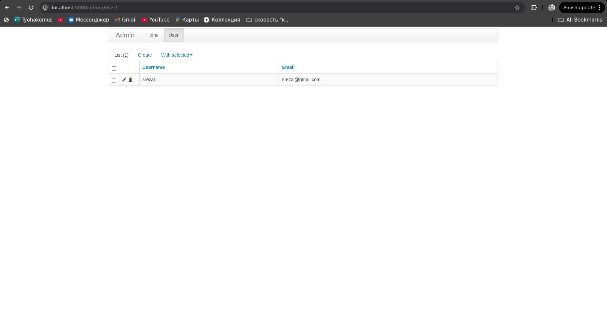
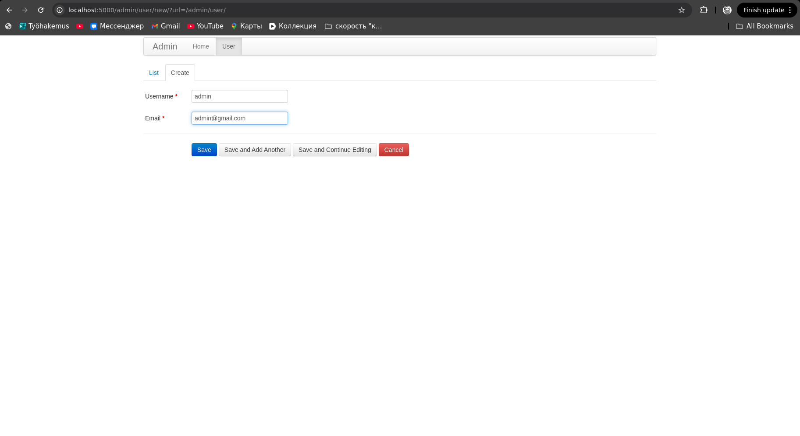
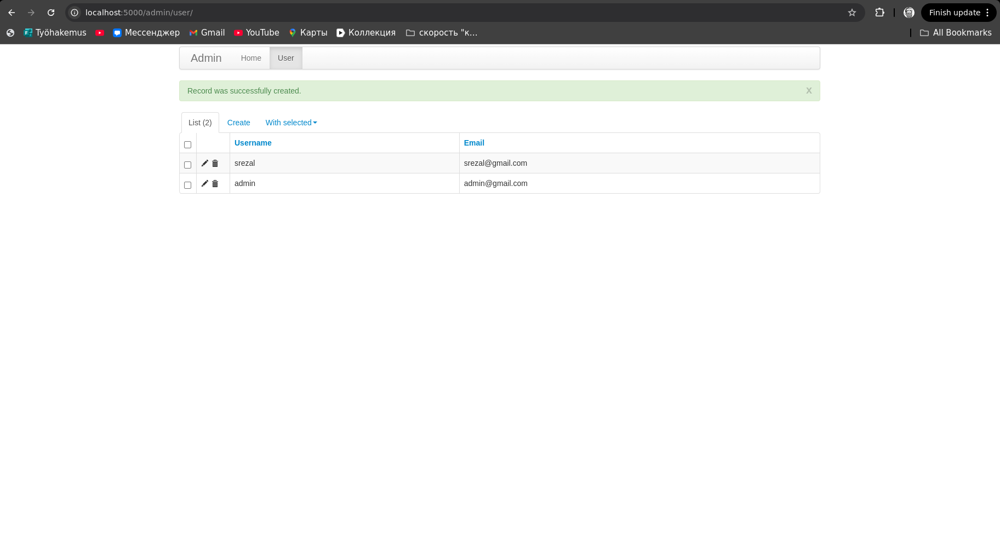

# Лабораторная работа "Docker: докеризация приложения"
## Выполнение работы

1. Было написано приложение на python Flask, которое благодаря модулю Flask-Admin позволяет выполнять CRUD операции над строками в таблице user. 
2. В качестве СУБД было принято решение использовать PostgreSQL.
3. Все переменные окружения были вынесены в отельный файл .env (в репозитории на github .env.example):
```
POSTGRES_HOST=localhost
POSTGRES_USER=default
POSTGRES_PASSWORD=default
POSTGRES_DB=db
SECRET_KEY=secret
```
4.Содержание Dockerfile следующее:
```

FROM python:3.12-alpine

RUN addgroup --system srezal && adduser --system --ingroup srezal --disabled-password srezal

USER srezal

RUN cd ~ && mkdir docker_app

WORKDIR /docker_app

COPY requirements.txt .

RUN pip3 install -r requirements.txt

RUN rm -rf /var/cache/apk/*

COPY ./src .

ENV FLASK_APP=app.py

ENTRYPOINT [ "./entrypoint.sh" ]
```

В качестве базового образа используется python:3.12-alpine. В начале создаётся новый пользователь, чтобы запуск контейнера выполнялся непривилегированным пользователем. Устанавлиются необходимые библиотеки, после этого очищается кэш. Копируются исходные файлы с миграциями. Указывается точка входа. 

5. После запуска контейнера выполняется bash-скрипт entrypoint.sh:
```
#!/bin/sh
python3 -m flask db init
python3 -m flask db migrate
python3 -m flask db upgrade
python3 main.py
```
Он выполняет миграции и запускает приложение.

6. Рассмотрим docker-compose.yml:
```
services:
  db:
    image: postgres
    environment:
      POSTGRES_PASSWORD: ${POSTGRES_PASSWORD}
      POSTGRES_USER: ${POSTGRES_USER}
      POSTGRES_DB: ${POSTGRES_DB}
    ports:
      - "5432:5432"
    volumes:
      - postgres-data:/var/lib/postgresql/data
    networks:
      - docker_network

  app:
    image: docker-app
    build: .
    environment:
      POSTGRES_HOST: ${POSTGRES_HOST}
      POSTGRES_PASSWORD: ${POSTGRES_PASSWORD}
      POSTGRES_USER: ${POSTGRES_USER}
      POSTGRES_DB: ${POSTGRES_DB}
      SECRET_KEY: ${SECRET_KEY}
    depends_on:
      - db
    ports:
      - "5000:5000"
    networks:
      - docker_network


volumes:
  postgres-data:
    driver: local

networks:
  docker_network:
    driver: bridge
```

В этом файле описываются два сервиса: db (для базы данных PostgreSQL) и app (для самого приложения).
- db: Здесь устанавливается использование Docker-образа PostgreSQL для запуска базы данных, задаются переменные окружения для контейнера базы данных (значения берутся из файла .env), открывается порт 5432 на хосте и пробрасывается в контейнер (также на порт 5432). Создается и монтируется volume с именем postgres-data, которое сохраняет данные базы данных.
- app: Этот сервис представляет собой контейнер, который запускает само приложение. Он использует образ docker-app, который собирается из текущей директории с помощью Dockerfile. Контейнер пробрасывает порт 5000, чтобы приложение было доступно извне. С помощью параметра depends_on он зависит от запуска контейнера с базой данных db. Это нужно, чтобы гарантировать, что база данных будет запущена перед приложением (иначе возникнут ошибки подключения). Здесь также считываются переменнные окружения. Приложение подключается к сети docker_network, что позволяет ему взаимодействовать с другими сервисами в пределах этой сети. 

7. Команда для запуска:
```
docker compose up --build
```
Она сбилдит образ docker-app если он ещё не билдился и запустит два контейнера.


9. После сборки вес образа составляет: 135MB

8. Пример запуска приложения:

```
[+] Running 0/0
[+] Running 0/1 Building                                                                       0.1s 
[+] Building 1.5s (14/14) FINISHED                                                   docker:default 
 => [app internal] load build definition from Dockerfile                                       0.0s
 => => transferring dockerfile: 383B                                                           0.0s
 => [app internal] load metadata for docker.io/library/python:3.12-alpine                      1.4s 
 => [app internal] load .dockerignore                                                          0.0s
 => => transferring context: 2B                                                                0.0s
 => [app 1/8] FROM docker.io/library/python:3.12-alpine@sha256:fd340d298d9d537a33c859f03bcc60  0.0s
 => [app internal] load build context                                                          0.0s
 => => transferring context: 1.27kB                                                            0.0s
 => CACHED [app 2/8] RUN addgroup --system srezal && adduser --system --ingroup srezal --disa  0.0s
 => CACHED [app 3/8] RUN cd ~ && mkdir docker_app                                              0.0s
 => CACHED [app 4/8] WORKDIR /docker_app                                                       0.0s
 => CACHED [app 5/8] COPY requirements.txt .                                                   0.0s
 => CACHED [app 6/8] RUN pip3 install -r requirements.txt                                      0.0s
 => CACHED [app 7/8] RUN rm -rf /var/cache/apk/*                                               0.0s
 => CACHED [app 8/8] COPY ./src .                                                              0.0s
 => [app] exporting to image                                                                   0.0s
 => => exporting layers                                                                        0.0s
 => => writing image sha256:c1669df434cea2d4e64caea5a90f0c48d2d257ccd11bc5bfc29be9fa3c8f89b9   0.0s
[+] Running 3/1o docker.io/library/docker-app                                                  0.0s
 ✔ Service app                 Built                                                           1.6s 
 ✔ Container docker-app-db-1   Created                                                         0.0s 
 ✔ Container docker-app-app-1  Created                                                         0.0s 
Attaching to app-1, db-1
db-1   | 
db-1   | PostgreSQL Database directory appears to contain a database; Skipping initialization
db-1   | 
db-1   | 2024-12-14 17:43:41.009 UTC [1] LOG:  starting PostgreSQL 17.2 (Debian 17.2-1.pgdg120+1) on x86_64-pc-linux-gnu, compiled by gcc (Debian 12.2.0-14) 12.2.0, 64-bit
db-1   | 2024-12-14 17:43:41.009 UTC [1] LOG:  listening on IPv4 address "0.0.0.0", port 5432
db-1   | 2024-12-14 17:43:41.009 UTC [1] LOG:  listening on IPv6 address "::", port 5432
db-1   | 2024-12-14 17:43:41.011 UTC [1] LOG:  listening on Unix socket "/var/run/postgresql/.s.PGSQL.5432"
db-1   | 2024-12-14 17:43:41.015 UTC [29] LOG:  database system was shut down at 2024-12-14 17:43:31 UTC
db-1   | 2024-12-14 17:43:41.018 UTC [1] LOG:  database system is ready to accept connections
app-1  | Error: Directory migrations already exists and is not empty
app-1  | INFO  [alembic.runtime.migration] Context impl PostgresqlImpl.
app-1  | INFO  [alembic.runtime.migration] Will assume transactional DDL.
app-1  | INFO  [alembic.ddl.postgresql] Detected sequence named 'user_id_seq' as owned by integer column 'user(id)', assuming SERIAL and omitting
app-1  | INFO  [alembic.env] No changes in schema detected.
app-1  | INFO  [alembic.runtime.migration] Context impl PostgresqlImpl.
app-1  | INFO  [alembic.runtime.migration] Will assume transactional DDL.
app-1  |  * Serving Flask app 'app'
app-1  |  * Debug mode: off
app-1  | WARNING: This is a development server. Do not use it in a production deployment. Use a production WSGI server instead.
app-1  |  * Running on all addresses (0.0.0.0)
app-1  |  * Running on http://127.0.0.1:5000
app-1  |  * Running on http://172.18.0.3:5000
app-1  | Press CTRL+C to quit

```

9. Пример работы приложения



